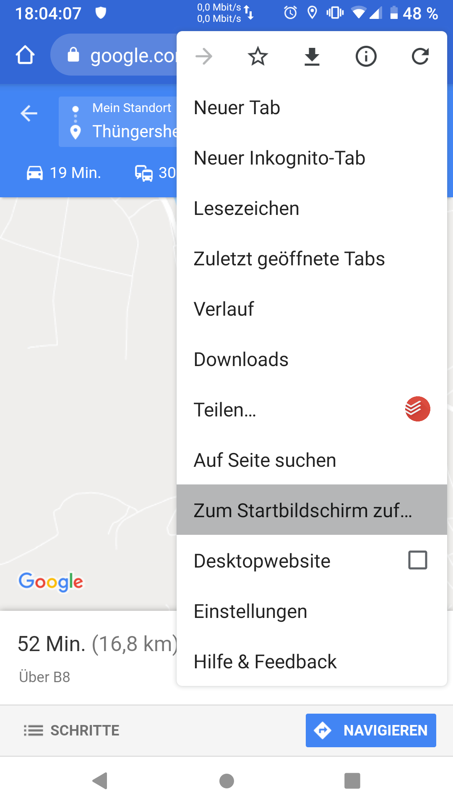
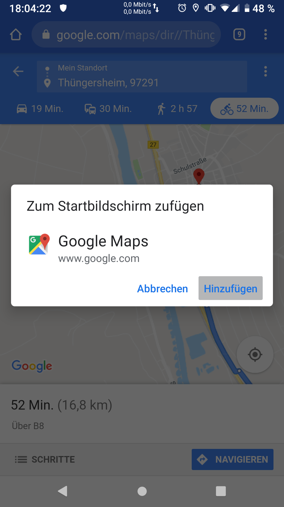
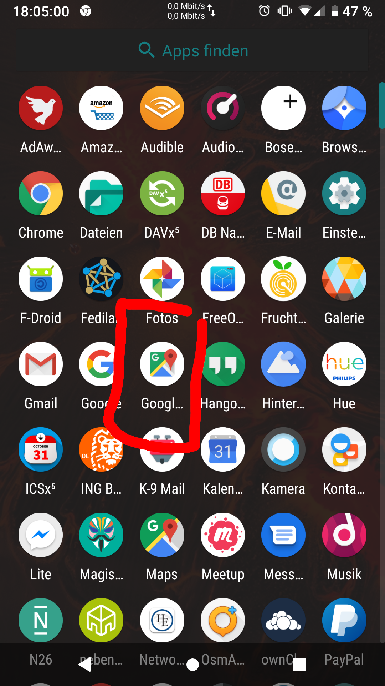
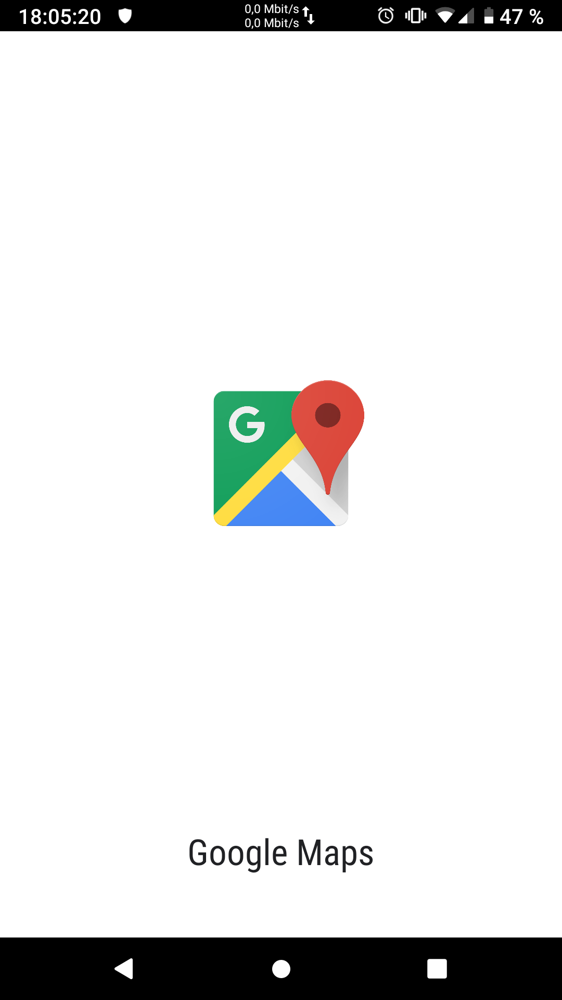
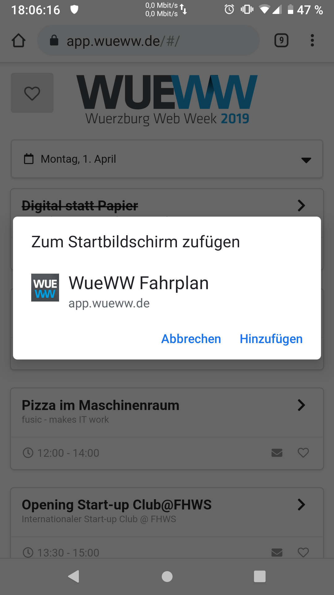
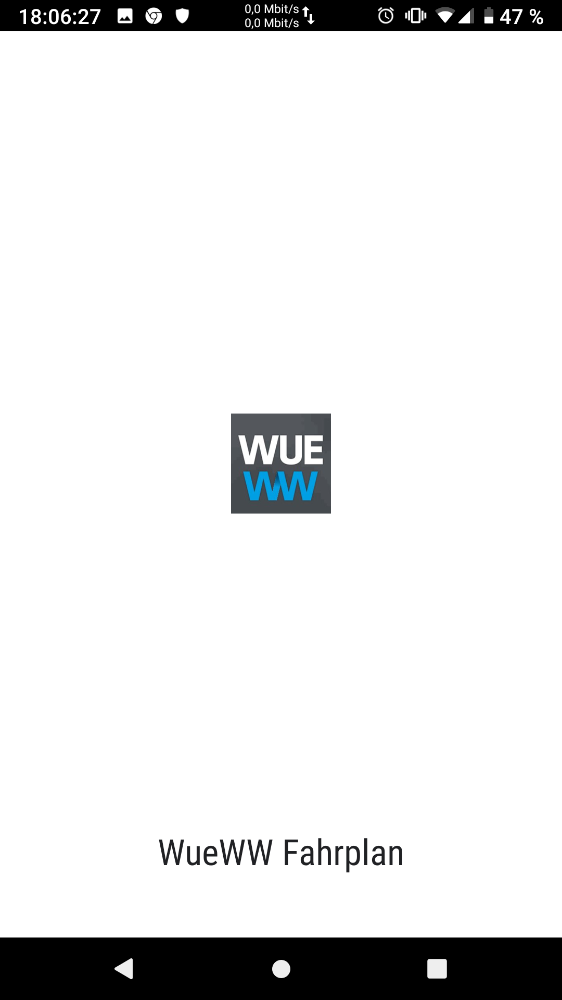
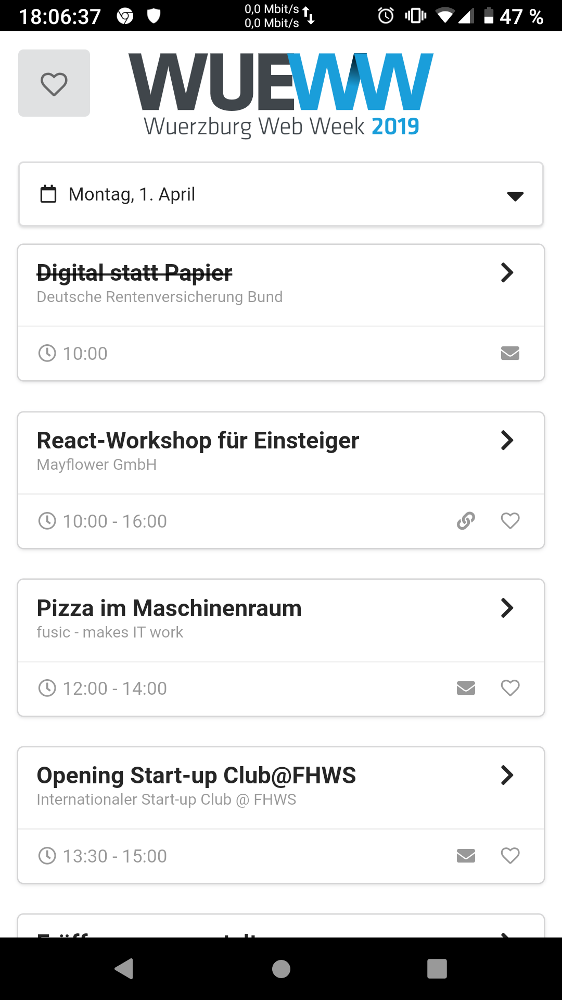

# PWAs

Stefan Siegl, aka Rolf  
(@stesie23, <rolf@mayflower.de>)

<!--s-->

# Who am I?

* Stefan Siegl, (inzwischen) aus Würzburg
* Software Developer
* hauptsächlich Spring Boot & React
* funktionale Programmierung & DevOps
* arbeite bei Mayflower GmbH, Würzburg

<!--s-->

# Agenda

* Begriffsbestimmung
* Konzepte
   * Web App Manifest
   * Service Worker
   * Kalender, GPS, Push, ...
* Hands On

<!--s-->

# Begriffsbestimmung

<!--v-->

Was ist eigentliche eine "Progressive Web App"?

<!--v-->



<!--v-->



<!--v-->



<!--v-->



<!--v-->



<!--v-->



<!--v-->



<!--v-->

Wie geht das?

<!--s-->

# Web App Manifest

* einfache JSON-Datei
* `<link rel="manifest" href="assets/manifest.json">`

<!--v-->

```json
{
    "name": "WueWW Fahrplan",
    "display": "standalone",
    "background_color": "#ffffff",
    "icons": [
        {
            "src": "android-icon-96x96.png",
            "sizes": "96x96",
            "type": "image/png",
            "density": "2.0"
        },
     ...
```

<!--s-->

okay, schön und gut ...

<!--v-->

aber: Funkloch!

... oder: okay, das muss auch offline klappen

<!--v-->

Lösung: Service Worker

... der programmierbare Proxy

<!--v-->

# Service Worker

* separater JavaScript "Prozess"
* kein Zugriff auf DOM
* nur ein SW pro Host
* kann Internetzugriffe abfangen
* Nachrichtenaustausch Seite <-> Service Worker
* kein direkter Einfluss, wie lange SW läuft

<!--v-->

## Caching Strategien

* cache first
* cache only
* network first
* network only
* stale while revalidate

<!--v-->

nicht selber machen, **Google Workbox** nehmen

gibt's auch als webpack-plugin :)

<!--v-->

```js
// webpack.config.js
const workboxPlugin = require('workbox-webpack-plugin');

...
plugins: [
  new workboxPlugin.GenerateSW({
    swDest: 'sw.js',
    clientsClaim: true,
    skipWaiting: true,
  })
]
```

<!--v-->

```js
if ('serviceWorker' in navigator) {
    window.addEventListener('load', () => {
        navigator.serviceWorker.register('sw.js')
    }
}
```

<!--s-->

## Was geht jetzt (nicht) damit?

<!--v-->

https://whatwebcando.today/

<!--v-->

man kann alle Browser Features nutzen  
(auch die weniger bekannten)

* (Push) Benachrichtigung
* Offline Storage
* (Background) Sync
* Audio, Video, Bilder
* Netzwerk, Batterie, Gerätespeicher
* Vordergrund-Erkennung
* Geräteposition, Lage, Beschleunigung
* Bildschirm-Orientierung
* Bluetooth, USB

<!--v-->

(noch) nicht, u.a.

* Kalender
* Kontakte
* Task Scheduler
* Wake Lock

<!--v-->

work arounds, z.B. Kalender

... man kann einen iCal Download anbieten

seid kreativ :)

<!--s-->

# Das war's!

## Fragen?

Stefan Siegl (@stesie23, <rolf@mayflower.de>)
